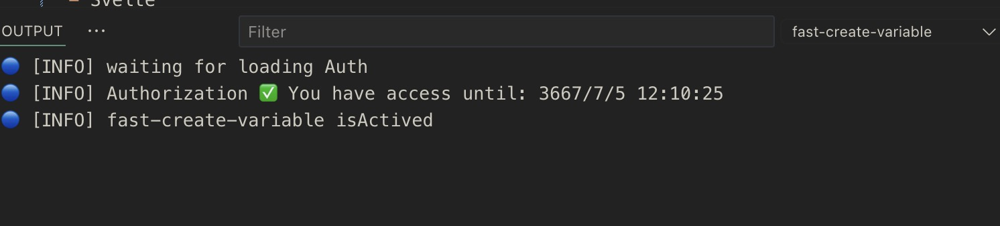

<p align="center">

</p>
<p align="center"> English | <a href="./README_zh.md">简体中文</a></p>

A VS Code extension to quickly create variables in various languages including Vue, React, and Svelte.

## Plugin Introduction

Select the variable name to quickly provide the creation type, such as `ref`, `computed`, `methods`, `function`, `arrowFunction`, `watch`, `reactive`, etc. Depending on whether it is currently Vue2 or Vue3, generate the corresponding variable and jump to the newly created variable location.

### Plugin Features

Normally, when we write code, we first write a template, such as `el-input`, then write `v-model` or `@click` and other events, and then go to the top to define `ref` or `function`. With this plugin, you can directly generate corresponding variables or methods in JS logic (supports generating multiple variables and methods at the same time), and then initialize variable values and supplement function logic according to your needs. This will save you a lot of time and reduce the burden of coding to initialize variables.

> If you can’t use it in Cursor because Cursor’s GitHub Login is not ready yet, you can use the command: `fast-create-variable.inputGithubToken`, enter your `GitHub Token`, and then you can use it. This process is absolutely safe. This token only needs the permission of `user:account`.

### Plugin Examples

- vue:


- react:


### Charge Plan

Currently, this plugin has a [paid plan](#-charge-plan). If you haven’t tried it yet, you can find me on [Discord](https://discord.com/invite/ZnjxzMKWNW) or wechat: `simon_he95` and get a one-month free trial.



## Supported Frameworks

- Vue
- JSX | TSX (React)
- Svelte
- Solid
- TS | JS

## Keybindings

- Windows: `Ctrl+G`
- Mac: `Cmd+G`

## Configuration

```json
{
  "configuration": {
    "type": "object",
    "title": "fast-create-variable",
    "properties": {
      "fast-create-variable.atTop": {
        "type": "boolean",
        "default": false,
        "description": "Generate data, methods, etc. for Vue2 at the top or at the bottom"
      },
      "fast-create-variable.sound": {
        "type": "boolean",
        "default": false,
        "description": "Play sound when variable is created"
      },
      "fast-create-variable.snippet": {
        "type": "array",
        "default": [
          {
            "name": "useRouter",
            "from": "vue-router",
            "position": "top",
            "languageIds": ["vue"],
            "content": "const router = useRouter()"
          }
        ],
        "description": "User code snippet inject to variable"
      }
    }
  }
}
```

## 📦 How to Configure Customization Snippet
```json
// examples
{
  "fast-create-variable.snippet": [
    {
      "name": "useRouter",
      "from": "vue-router", // Dependent packages, if there are dependent packages, it will automatically determine whether to import them in the header
      "position": "top",
      "languageIds": [ // Settings take effect in those languages, vue, typescriptreact, typescript, javascriptreact, vue-vine
        "vue"
      ],
      "content": "const router = useRouter()" // Code Snippet
    },
    {
      "name": "useLocation",
      "from": "react-router-dom", // Dependent packages, if there are dependent packages, it will automatically determine whether to import them in the header
      "position": "top",
      "languageIds": [
        "typescriptreact"
      ],
      "content": "  const locations = useLocation()\n  const params = qs.parse(locations.search, { ignoreQueryPrefix: true })",
      "isInJSX": true,
      "additionalDependencies": [ // When your code snippet may use additional dependencies, you can configure them here
        {
          "name": "qs",
          "from": "qs",
          "isDefault": true // Is it the default import? The default is false. If it is false, { qs } will be imported.
        }
      ]
    },
    {
      "name": "import",
      "from": "",
      "position": "hoist-top", // Insert after the last import
      "languageIds": [
        "vue",
        "typescriptreact",
        "typescript",
        "javascriptreact"
      ],
      "content": "import ${2:moduleName} from '${1:module}'"
    },
    {
      "name": "@click",
      "from": "",
      "position": "current",
      "description": "In the vue template, create a @click event at the current location",
      "languageIds": [
        "vue"
      ],
      "content": "@click=\"${1|clickHandler,handleClick,onClick,removeHandler,onRemove,closeHandler,onClose,openHandler,onOpen,submitHandler,onSubmit,onLogin,onLogout,toggleHandler,onToggle,showHandler,onShow,hideHandler,onHide|}$2\""
    }
  ]
}
```

## 💰 Charge plan

- [Sponsor](https://github.com/Simon-He95/sponsor) me by wechat or alipay, and I will give you more permissions and time to use your GitHub account
- For users who haven't experienced it yet, you can find me on [discord](https://discord.gg/acz4n2jx2v) to get a one-month free experience qualification.
- Current plan 15 Yuan/month, 150 Yuan/year
- Any `bug` or `suggestion` on the plugin can be communicated on `discord`, or add me wx: `simon_he95`, pull you into the wx group

## :coffee:

[buy me a cup of coffee](https://github.com/Simon-He95/sponsor)

## Sponsors

<p align="center">
  <a href="https://cdn.jsdelivr.net/gh/Simon-He95/sponsor@main/sponsors.svg">
    
  </a>
</p>
