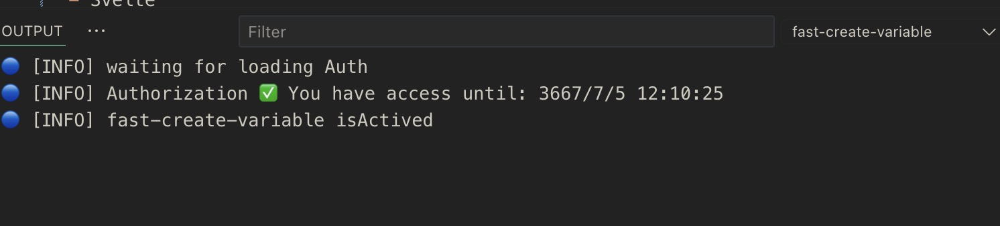

<p align="center">

</p>
<p align="center"> <a href="./README.md">English</a> | 简体中文</p>

通过快捷键加选择类型来生成变量并根据场景插入对应位置

## 插件介绍

选中变量名快速提供创建类型，比如 `ref`、`computed`、`methods`、`function`、`arrowFunction`、`watch`、`reactive` 等等。根据当前是 Vue2 还是 Vue3，生成对应的变量，并跳转到新创建的变量位置。目前插件是按需启动，当你通过快捷键激活才会加载，并校验你是否可以使用。

### 插件功能

正常我们写代码时，先写模板（如 `el-input`），然后写 `v-model` 或 `@click` 等事件，再去顶部定义 `ref` 或 `function`。通过这个插件，可以直接在 JS 逻辑中生成对应的变量或方法（支持同时生成多个变量和方法），然后根据需求初始化变量值和补充函数逻辑。这将节省大量时间和减少初始化变量的编码负担。

> 如果你在 Cursor 中不能使用，因为 Cursor 的 Github 登录还未完成，可以通过命令 `fast-create-variable.inputGithubToken` 输入你的 Github Token，然后就可以使用了。这个过程是绝对安全的，这个 token 只需要 `user:account` 的权限。

### 插件示例

- vue:


- react:


### 收费计划

目前这个插件已有收费计划。如果你还未体验过，可以在 [Discord](https://discord.gg/acz4n2jx2v) 或者 微信: `simon_he95` 上找到我，获得一个月免费体验资格。



## 支持的框架

- Vue
- JSX | TSX (React)
- Svelte
- Solid
- TS | JS

## 按键绑定

- Windows: `Ctrl+G`
- Mac: `Cmd+G`

## 配置

```json
{
  "configuration": {
    "type": "object",
    "title": "fast-create-variable",
    "properties": {
      "fast-create-variable.atTop": {
        "type": "boolean",
        "default": false,
        "description": "生成 data, methods, etc. 在 Vue2 中的顶部或者底部"
      },
      "fast-create-variable.sound": {
        "type": "boolean",
        "default": false,
        "description": "创建变量时播放声音"
      },
      "fast-create-variable.snippet": {
        "type": "array",
        "default": [
          {
            "name": "useRouter",
            "from": "vue-router",
            "position": "top",
            "languageIds": ["vue"],
            "content": "const router = useRouter()"
          }
        ],
        "description": "用户代码片段注入到变量"
      }
    }
  }
}
```

## 📦 如何配置自定义 Snippet
```json
// examples
{
  "fast-create-variable.snippet": [
    {
      "name": "useRouter",
      "from": "vue-router", // 依赖包, 如果有依赖包, 则会自动判断是否在头部导入
      "position": "top",
      "languageIds": [ // 设置在那些语音下生效, vue, typescriptreact, typescript, javascriptreact, vue-vine
        "vue"
      ],
      "content": "const router = useRouter()" // 代码片段
    },
    {
      "name": "useLocation",
      "from": "react-router-dom", // 依赖包, 如果有依赖包, 则会自动判断是否在头部导入
      "position": "top",
      "languageIds": [
        "typescriptreact"
      ],
      "content": "  const locations = useLocation()\n  const params = qs.parse(locations.search, { ignoreQueryPrefix: true })",
      "isInJSX": true,
      "additionalDependencies": [ // 你的代码片段中可能会用到额外的依赖的时候, 可以在这里配置
        {
          "name": "qs",
          "from": "qs",
          "isDefault": true // 是否是默认导入, 默认是 false, 如果是 false, 则会导入 { qs }
        }
      ]
    },
    {
      "name": "import",
      "from": "",
      "position": "hoist-top", // 插入最后一个 import 导入之后
      "languageIds": [
        "vue",
        "typescriptreact",
        "typescript",
        "javascriptreact"
      ],
      "content": "import ${2:moduleName} from '${1:module}'"
    },
    {
      "name": "@click",
      "from": "",
      "position": "current",
      "description": "在 vue template 中, 当前位置创建 @click 事件",
      "languageIds": [
        "vue"
      ],
      "content": "@click=\"${1|clickHandler,handleClick,onClick,removeHandler,onRemove,closeHandler,onClose,openHandler,onOpen,submitHandler,onSubmit,onLogin,onLogout,toggleHandler,onToggle,showHandler,onShow,hideHandler,onHide|}$2\""
    }
  ]
}
```

## 💰 收费计划

- 通过微信或支付宝赞助我，我将为您提供更多使用 GitHub 帐户的权限和时间
- 对于尚未体验的用户，您可以在 [discord](https://discord.com/invite/ZnjxzMKWNW) 上找到我，获得一个月免费体验资格。
- 目前计划 15 元/月，150 元/年
- 插件上的任何 `bug` 或 `suggestions` 都可以在 `discord` 上交流，或者加我 wx: `simon_he95`，将您拉入 wx 群

## :coffee:

[请我喝一杯咖啡](https://github.com/Simon-He95/sponsor)

## Sponsors

<p align="center">
  <a href="https://cdn.jsdelivr.net/gh/Simon-He95/sponsor@main/sponsors.svg">
    
  </a>
</p>
